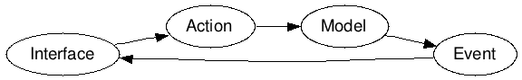

# Concept

The principle of Jlive is based on the triplet **screen** / **action** / **event**. 

This creates a unified operation of the application. 
We see the display, an action changes an object (model), an event is issued to inform the change of content / value of the object. Then, the display is rebuilt with the new values. 

Unlike a conventional operation, the call to action will not return a result or value that will be used in the display. The call for action causes a change in the model, and this change will be reflected in the display via the receipt of an event send by the server.

This is what we called the **one way workflow**.

# One way workflow

# JADE sample
    script
      var sondeList =  new jLive('/allsondes.json')
        .setTemplate('.templatejLive')
        .setLayout('.viewRendererJLive');

      sondeList.fetch({});

 
